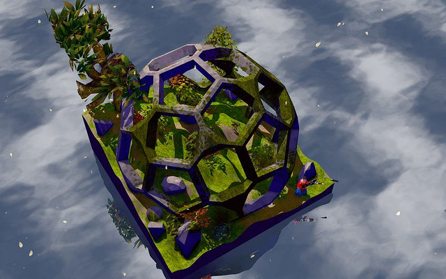

# DD-D

## What is the project about
The idea is to create a platforming game where the player only see a 2D slice of a 3D world and has to figure out what is in the map and where they should go.

## Issue
Using an ortographic camera i can easily show the 3D world in 2D. I placed the camera as son of the player and it turns with the player allright.
The main issue lies in how to show to the camera object that are present in the scene but are seen inside thus not rendering since 3D objects do not have an internal texture but they are transparent. 
Adjusting near and far clipping planes does not solve the problem since to capture just a slice of the world they need to be very close to each other and the player
My idea was to create a shader that check whatever is inside the frustum that is not rendered and force render its border to show but i have no experience in that.

I would really appreciate your help, write me here on github or any other social you see linked in my profile, thanks a lot.

### Engine
Unity 2022 LTS version

## Miegakure is the perfect example
What i would like to achieve is a 2D slice of a 3D world in a similar way how this game gives a 3D slice of a 4D world

